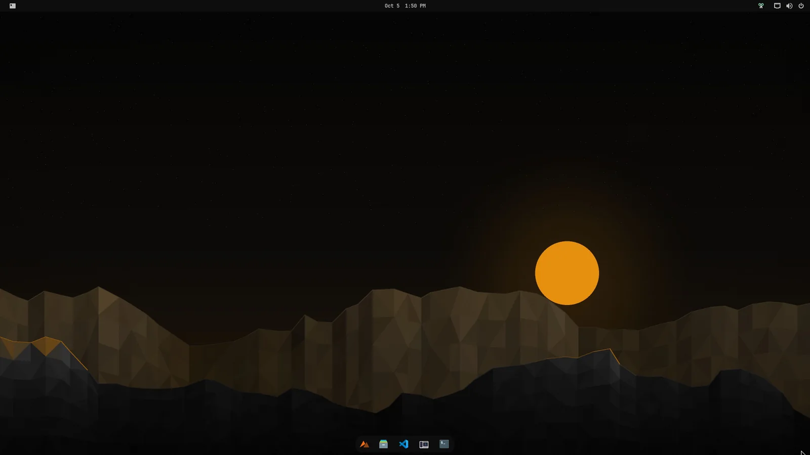
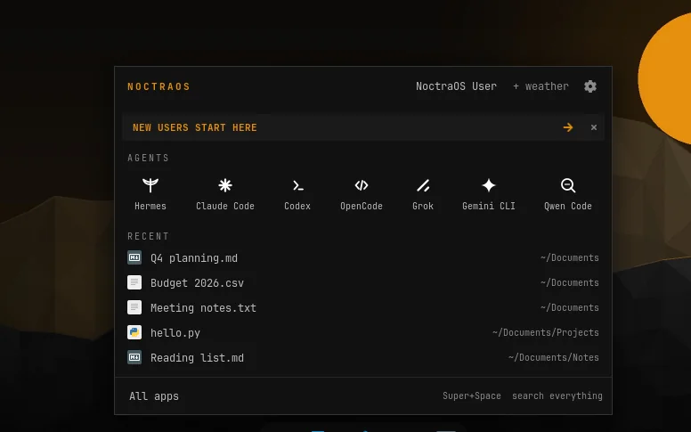
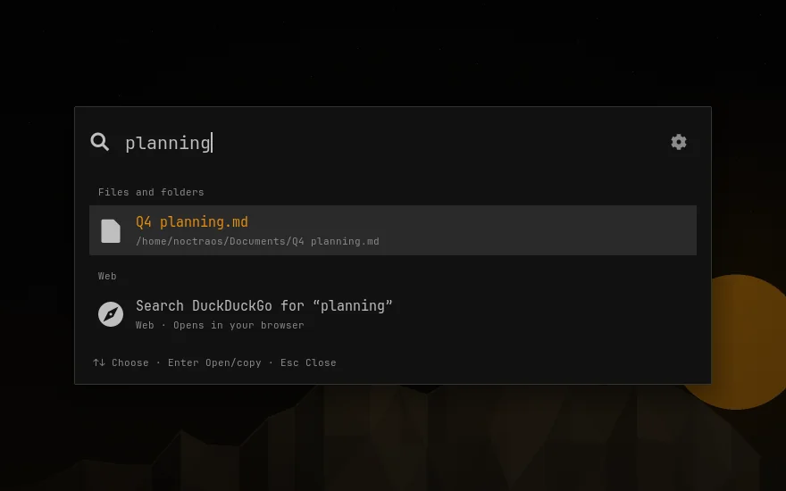
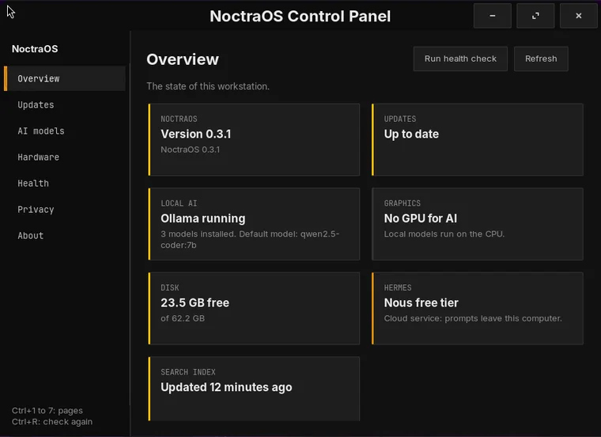
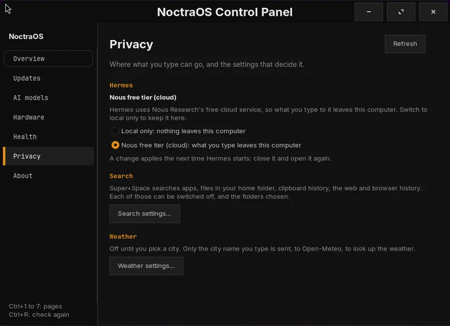

<p align="center">
  <a href="https://noctraos.dev"></a>
</p>

<h1 align="center">NoctraOS</h1>

<p align="center"><strong>An AI development workstation OS.</strong></p>

<p align="center">
  <a href="https://noctraos.dev/download">Download</a> ·
  <a href="https://noctraos.dev">Website</a> ·
  <a href="#documentation">Documentation</a> ·
  <a href="CONTRIBUTING.md">Contribute</a>
</p>

NoctraOS is an Ubuntu-based AI development workstation OS. Local AI and coding
assistants are one click from the Start button, a short welcome helps you settle
in, and the desktop is dark with a little amber along the way.

[](site/img/shots/full/desktop.webp)

## What you get

- **One shortcut: Super + Space.** Find apps, files, clipboard history, and
  the web. Browser history is available if you opt in.
- **AI on your computer.** Ollama runs local models; VS Code and Continue are
  set up to use them.
- **A Control Panel.** Updates, your apps, Git and GitHub setup, AI models,
  your graphics card, a health check, and your privacy choices in one window,
  with no terminal needed.
- **Assistants within reach.** Hermes Desktop, Codex, Claude Code, OpenCode,
  Grok, Gemini CLI, and Qwen Code have a place in the Start panel. Hermes,
  Ollama and the coding agents follow their publishers' newest releases, and
  the Control Panel shows which version you have.
- **The everyday tools, too.** A browser, office apps, media tools, a task
  manager, and support for Flatpaks and AppImages.

| The Start panel | Super + Space search |
| :---: | :---: |
| [](site/img/shots/full/start-panel.webp) | [](site/img/shots/full/search-files.webp) |

| The Control Panel | Privacy choices |
| :---: | :---: |
| [](site/img/shots/full/control-overview.webp) | [](site/img/shots/full/control-privacy.webp) |

*Real screenshots from a running NoctraOS VM. Click any image for the full view.*

**A note on AI:** Ollama runs locally. Hermes' free tier uses the Nous cloud,
so prompts leave your computer; a local-only option is available. Other coding
assistants use their own providers and may need accounts.

## Try it

**[Download the installer or a VM disk →](https://noctraos.dev/download)**

The download page has ISO, QCOW2, and VMDK images, checksums, and instructions.
Aim for **8 GB RAM minimum** (16 GB recommended) and **25 GB free disk** for setup.
First login needs internet and roughly **25–40 minutes** to set up the AI tools.
The VM disks are trial appliances: they sign in as `noctraos` (password
`noctraos`) with passwordless sudo.

**On Proxmox VE** (8 or 9), run this on the host as root. It asks for RAM, cores and
storage, checks the download against `SHA256SUMS`, and creates a UEFI VM from the
ready-made disk or the installer ISO:

```sh
bash <(curl -sSfL https://raw.githubusercontent.com/dazeb/noctraos/main/proxmox-install.sh)
```

More options are in the [setup guide](docs/setup.md#install-on-proxmox-ve).

This is an early release, tested in VMs; a full interactive install and real
hardware testing are still on the to-do list. Back up before installing.
For an existing compatible system or your own ISO build, see the
[setup guide](docs/setup.md).

## Come build with us

First contribution or fiftieth, you're welcome here. Try it on your laptop,
report something confusing, fix a typo, improve a screenshot, suggest a design,
or write some code. Useful feedback counts as a contribution, too.

We're making a desktop we'd like to use, and having some fun along the way.
You don't need to be a Linux wizard to help. **[See how to contribute](CONTRIBUTING.md)**
or **[open an issue](https://github.com/dazeb/noctraos/issues)** and say hello.

Questions, press, or a security report: **[admin@noctraos.dev](mailto:admin@noctraos.dev)**.

## Documentation

| Looking for… | Start here |
| --- | --- |
| Setup, configuration, GPU support, maintenance, or troubleshooting | [Setup guide](docs/setup.md) |
| The project's direction and principles | [Objectives](docs/objectives.md) |
| The welcome, dock, Start panel, and search experience | [Onboarding](docs/onboarding.md) · [Desktop layout](docs/desktop-layout.md) |
| The Control Panel: updates, apps, accounts, models, hardware, health, privacy | [Control Panel](docs/control-panel.md) |
| How an installed system gets new features: signed, staged rolling updates | [Updates](docs/updates.md) |
| Themes and the included app set | [Theme design](docs/theme-design.md) · [App comparison](docs/omarchy-parity.md) |
| Testing and your first change | [Contributing](CONTRIBUTING.md) |
| Release progress and remaining validation | [Release runbook](docs/release-runbook.md) |

## Credits and license

Built on **Zorin OS 18 / Ubuntu 24.04 LTS**, with thanks to their communities,
and inspired by [Omarchy](https://omarchy.org) and [Omakub](https://omakub.org).
NoctraOS is independent and isn't affiliated with or endorsed by those projects.

No license has been selected yet; all rights reserved until then. Agent names
and logos belong to their respective projects.
