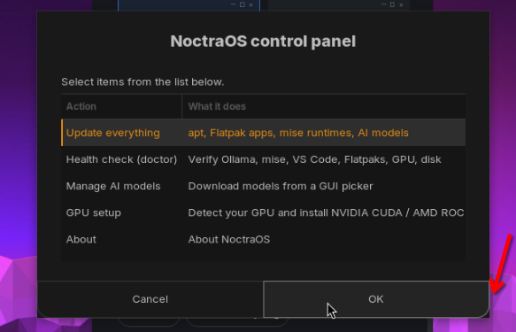

# NoctraOS Control Panel: rebuild plan

> **Status: built** (phases 0 to 6). This is the design record; how it works now is in [control-panel.md](control-panel.md).

Written 2026-10-06 for a fresh session. The current panel (`bin/noc-menu`) is a zenity list and
needs a proper rebuild. This file is the whole brief: read it, then `AGENTS.md` and
`docs/objectives.md`, then start at phase 0.

**Kickoff prompt for the new session**

> Read `docs/control-panel-plan.md`, `AGENTS.md` and `docs/objectives.md`. Build the NoctraOS
> Control Panel described in the plan, phase by phase, on one deliberately named feature branch
> per phase, cut from an up-to-date `main` (AGENTS.md rule 8 only forbids *stray* branches; this
> is the intended workflow, and `main` itself stays untouched until I merge). Ask me before
> phase 1 if any "Open questions" answer changes the design; otherwise proceed, test every phase
> on the local KVM VM (`iso/local-vm.sh`), and open one PR per phase. Never run `install.sh` on
> this workstation, never touch the Proxmox node, and do not merge or publish without asking.

## 1. What is there today

`bin/noc-menu` (39 lines, installed by `install/07_persistence.sh`, launcher
`/usr/local/share/applications/noc-menu.desktop`, icon `applications-system`):

- A `zenity --list` with five rows: Update everything, Health check, Manage AI models, GPU setup,
  About. OK/Cancel buttons, a second column that truncates ("…NVIDIA CUDA / AMD ROC"), no icons,
  no status, no progress.
- **Every action opens a terminal** (`gnome-terminal -- bash -lc "noc …; read -n 1"`), which breaks
  objective 2, *No terminal required*. `noc update` also needs `sudo`, so it asks for a password
  inside that terminal.
- "Manage AI models" is a second zenity list (`noc models gui`) with six hardcoded presets
  (`MODEL_PRESETS` in `bin/noc`); it cannot show what is installed, remove a model or show progress.
- "GPU setup" runs `noc gpu detect && noc gpu install` straight away, with no summary or consent
  step before a ~GB driver/CUDA install and a reboot.
- "About" still says "built on Zorin OS" and has no version or links.
- It is not part of the look the rest of the system has (palette, monospace accents, sharp
  corners), and nothing in the Start panel or the welcome points to it. Two related launchers
  (`noctraos-health-check.desktop`, `noctraos-ollama-models.desktop`) also open terminals/zenity.
- The CLI underneath is fine and stays the source of truth: `bin/noc` (`update`, `doctor`,
  `models [list|pull|rm|gui]`, `bg`, `gpu`) and `bin/noc-gpu` (detect | install | status).

## 2. Goal

One GTK window, "NoctraOS Control Panel" (working name), that is the **mouse-driven home of
everything a workstation owner maintains**, with live status, in-app progress and no terminal.
It is the GUI for `noc`, not a second implementation: every action calls `noc`/`noc-gpu`/
`noctraos-hermes`, so the CLI and the GUI cannot drift.

Non-goals: a theme switcher (we fix the theme), replacing GNOME Settings, remote management, a
web UI, anything that needs network access to open.

## 3. Principles (from `docs/objectives.md`, `AGENTS.md`)

- No terminal required; the terminal stays available for people who want it ("Show details" can
  expand the raw log inside the app).
- AI first: models, Hermes mode (cloud vs local only) and GPU are front-page items, not buried.
- Honest and consent-based: say what an action will download/install/restart before it runs;
  never describe Hermes as local without the cloud qualification (see AGENTS.md pitfalls).
- Same look as the Welcome and Appearance windows: GTK 3 + CSS from `configs/theme/palette.json`
  (charcoal, amber, JetBrains Mono accents). Those two still use a 2 px radius; match them first,
  and bring all three to 0 px together if the owner agrees (open question).
- Clean breaks, no shims (repo rule): the new app replaces `noc-menu`; remove the old file, its
  install line, its launcher and every reference rather than keeping an alias.

## 4. Proposed design

A `Gtk.ApplicationWindow` with a left sidebar and a stack of pages. Python 3 with
`#!/usr/bin/python3` pinned (a mise `python3` has no PyGObject: AGENTS.md pitfall). Files:
`bin/noctraos-control` (app), `assets/icons/noctraos-control.svg` (white glyph like the others),
a launcher in `configs/applications/`, module 07 installs it and removes `noc-menu`.

| Page | Shows | Actions |
|---|---|---|
| **Overview** | status cards: NoctraOS version, updates pending, Ollama running + default model, GPU/driver, disk free, Hermes mode, search index age | each card links to its page; "Run health check" |
| **Updates** | what will update (apt, Flatpak, mise runtimes, Ollama models) with per-item checkboxes, download size, "reboot needed" | Update selected; progress bar + expandable log; no terminal |
| **AI models** | installed models with size, which is the default, suggestions chosen from RAM/VRAM | pull with progress, remove, set default, custom name field |
| **Hardware** | GPU detected, driver/CUDA/ROCm state, free disk, RAM | install driver after an explicit summary + consent + reboot notice (never automatic) |
| **Health** | the doctor checks as a list with OK / warn / fail rows and a fix button where one exists (e.g. AppManager missing → the helper's `module 04d_appmanager.sh` operation, see below) | Re-check; "Copy report" for bug reports |
| **Privacy and AI** | Hermes: free tier (Nous cloud) or local only; search roots/browser history; weather | toggles that call `noctraos-hermes local` and the new inverse `noctraos-hermes cloud` / the existing settings windows |
| **Appearance** | wallpaper and fonts | open `noctraos-appearance` (or embed later) |
| **About** | version, base OS credit (Zorin OS / Ubuntu), licence, links, contact | copy diagnostics |

Privileged work: do not ask for a sudo password in a terminal. Use `pkexec` with a small polkit
policy for a root helper (`noc-privileged`) so the GUI gets a normal authentication dialog. Check
what is already passwordless on the appliance image (NOPASSWD) so it does not prompt twice. The
helper is an allowlist, never a shell: each operation is a fixed verb with validated arguments.
Operations: apt update/upgrade, flatpak system update, driver install, and `module <name>` for the
health-page fixes. Modules call `sudo` themselves, which has no TTY under a GTK subprocess on a
password-protected release install, so `module` must run as root through the helper (a
`NOCTRAOS_AS_ROOT=1`-style path in `install.sh`/`lib.sh` that skips `sudo` when already root) and
accept only an allowlisted set of module names (start with `04d_appmanager.sh`). Any fix button
whose operation is not in the helper is omitted rather than shelling out to `sudo`.

Long jobs run as a subprocess; stream stdout line by line into the progress UI. Never block the
GTK main loop. Ollama pulls use its HTTP API (`POST /api/pull` streams JSON progress) instead of
parsing `ollama pull` output.

## 5. CLI work the GUI needs (do this first)

The GUI should consume structured output, not scrape coloured text:

- `noc doctor --json`: `[{"id","label","status":"ok|warn|fail|info","detail","fix"}]`. Keep the
  current text output as the default. (`bin/noc` `cmd_doctor`, ~lines 112 to 200.)
- `noc status --json`: the Overview cards (version, updates pending via
  `apt-get -s upgrade`/`flatpak remote-ls --updates`, Ollama up, models, disk, GPU, Hermes mode
  via `noctraos-hermes status`).
- `noc update --json` (or `--progress`): one JSON line per step/percent so the UI can draw
  progress; steps are the four in `cmd_update`. Add `--only apt|flatpak|mise|models`.
- `noc-gpu detect --json` already needs checking; `noc-gpu` is 819 lines with fixture-based tests
  (`tests/test_gpu_detect.py`); extend rather than reimplement.
- `noc models list --json` (name, size, modified) and `noc models default <name>`. Ollama has no
  global default, so this needs a decision first (phase 0): store the choice in one file
  (suggested `~/.config/noctraos/model`, plain model name) and migrate **every** consumer to read
  it, otherwise the panel claims a default the AI integrations ignore. Today they hardcode
  `qwen2.5-coder:7b` or read a process-only `NOCTRAOS_MODEL`: `bin/noctraos-hermes:29`,
  `bin/noctraos-welcome:35`, `install/03_ai_core.sh:6`, `configs/nautilus-scripts/Ask AI to Explain:7`,
  `configs/vscode/continue_config.yaml` (seeded only when missing, so existing copies keep the old
  model; say so or rewrite the model lines on change) and `configs/hermes/onboarding.md`. Precedence:
  `NOCTRAOS_MODEL` env, then the file, then `qwen2.5-coder:7b`. Add a tested `noc models default`
  with no argument that prints the effective model, and have the Overview card use it.
- `noctraos-hermes cloud`: the inverse of `local` (today its undo is the manual
  `hermes config set model.provider auto`). It must set `model.provider auto`, which the wrapper
  already treats as unset, and undo what `local` wrote (`model.default`, `model.base_url`; check how `hermes config` clears a key), leaving free-tier state intact, so the Privacy toggle works both ways
  without a terminal. Update the wrapper's usage string and `status` output to match.
- Unit tests in `tests/` for every pure function (parsing, RAM to model suggestion, JSON shape).

## 6. Phases

0. **Decide and scaffold.** Settle the open questions and the single model-default store (section
   5), create the branch, copy the window/CSS scaffolding from `bin/noctraos-appearance` (169 lines, the smallest GTK app here).
1. **CLI JSON modes + tests** (section 5). Acceptance: `python3 -m unittest discover -s tests`
   green; `noc doctor --json | jq .` valid on the local VM.
2. **Shell of the app**: window, sidebar, Overview and About, the CSS, launcher, icon, install via
   module 07, `noc-menu` removed. Acceptance: opens from the Start menu on the VM, matches the
   other windows, no terminal.
3. **Health + Models pages** (read-mostly, safest). Acceptance: pull a small model with a live
   progress bar; remove it; doctor rows match `noc doctor`.
4. **Updates page + privileged helper (pkexec/polkit).** Acceptance: update runs to completion on
   the VM with a single auth dialog and a progress bar; "reboot needed" shown when
   `/var/run/reboot-required` exists; works when offline (clear message, no hang).
5. **Hardware/GPU + Privacy pages.** The test VM has no GPU: cover detection with the fixture
   tests, drive the install path with `noc gpu install --dry-run`, and say plainly that real
   hardware is untested. Hermes toggle verified with `noctraos-hermes status`.
6. **Polish and docs**: keyboard navigation, tooltips, empty and error states, HiDPI, screenshots
   for `site/` and the README, update `docs/onboarding.md`, `docs/desktop-layout.md`,
   `AGENTS.md` (repo map, commands, pitfalls), and the Start panel/welcome so people find it.

One PR per phase; each must pass the AGENTS.md "Verification checklist": `bash -n` + shellcheck on
touched scripts (add new scripts to `.gitlab-ci.yml`, `.github/workflows/ci.yml` and the AGENTS.md
command lists), `python3 -m py_compile` for the app, the unit tests, a deploy of the touched modules
to the local KVM VM (`iso/local-vm.sh`, see how earlier sessions did it in `docs/release-runbook.md`),
a second run to prove idempotency, and screenshots of the result.

## 7. Pitfalls that will bite (all in AGENTS.md; repeated because they are costly)

- Never run `install.sh`/`boot.sh` on the dev workstation; test on the local KVM VM. Never touch
  the Proxmox node or VMs 107/108/113/114.
- gsettings from a script needs the user session bus (`as_user` in `install/lib.sh`); never `dbus-launch`.
- `sudo -v` needs a TTY even with NOPASSWD: use `sudo -n true` first; the GUI must use pkexec.
- No `grep -q` on large pipes under `set -o pipefail`; every module must be idempotent;
  desktop-settings steps warn, they do not die.
- Python GUI apps pin `#!/usr/bin/python3`. A Wayland session has no `xdotool`; drive tests with
  `iso/local-vm.sh click/key/shot` and `gnome-screenshot` over SSH.
- Logging out of the VM lands on a broken GDM greeter: reboot instead.
- The release ISO must not contain test credentials; the control panel must not store secrets.
- Ollama may be down or still pulling the first model right after install: every page needs a
  "not ready yet" state, not an exception.

## 8. Open questions for the owner

1. Name and entry point: "Control Panel", "NoctraOS Settings" or "Workstation"? Own Start-panel
   entry, or replace the gear (which opens GNOME Settings today)?
2. Move the Welcome, Appearance and this window to 0 px corners now, to match the shell?
3. Should Updates auto-check in the background (a user timer + notification), or only on demand?
4. Is a "Reset to defaults" (Start panel, search, Hermes mode) wanted on the Privacy page?
5. Keep a `noc menu` CLI subcommand that opens the panel, or only the launcher?

## 9. Progress and working defaults

Phase 0 is done: the open questions above get these working defaults, so building can proceed.
Each is cheap to change, so the owner can override any of them at review.

1. Name: "NoctraOS Control Panel", launcher entry only for now (the Start-panel gear stays on GNOME
   Settings until phase 6).
2. Corners: match the Welcome and Appearance windows (2 px) first; moving all three to 0 px is a
   separate follow-up.
3. Updates: on demand only; no background timer or notification.
4. No "Reset to defaults" button yet.
5. No `noc menu` subcommand; the launcher is the only entry point.

Model default (section 5): `~/.config/noctraos/model`; precedence `NOCTRAOS_MODEL`, file, shipped model.

- [x] Phase 0: decisions, branch
- [x] Phase 1: CLI JSON modes + tests (`doctor --json`, `status`, `update --json --only`,
      `models list --json | default | presets`, `noctraos-hermes cloud | mode`)
- [x] Phase 2: GTK shell, Overview and About, `noc-menu` removed (#42)
- [x] Phase 3: Health and AI models pages (#43)
- [x] Phase 4: Updates page and the pkexec/polkit privileged helper (#45)
- [x] Phase 5: Hardware/GPU and Privacy pages
- [x] Phase 6: keyboard, tooltips, screen-fit, headless smoke test, entry points (Start panel, welcome, help), docs, site and README screenshots
