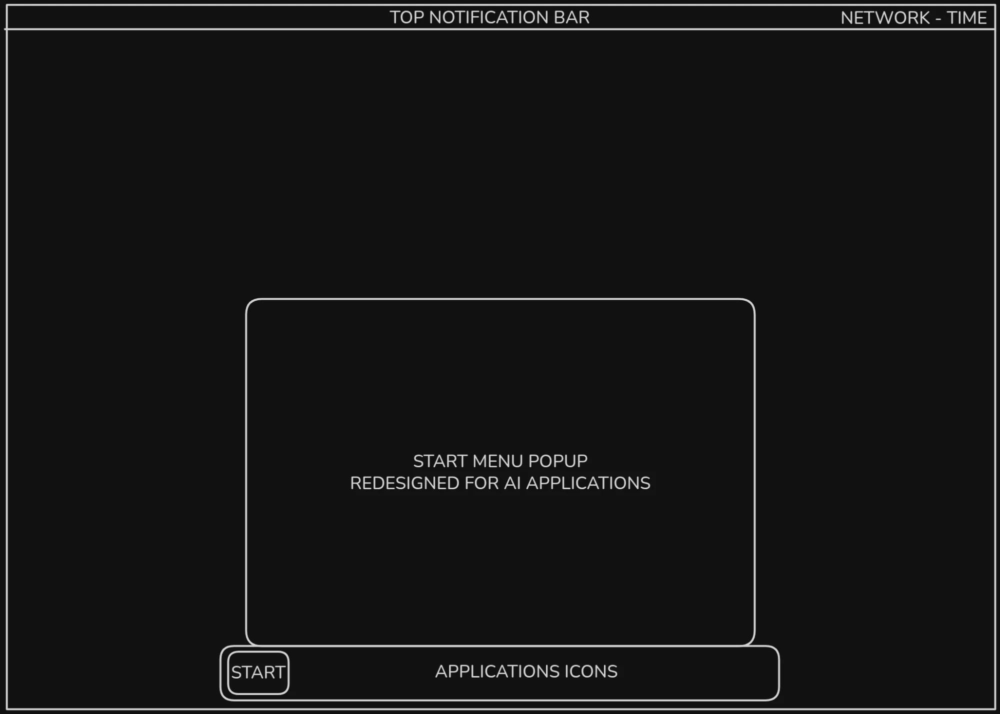

# Desktop layout (target)

Owner's mockup: [`mockups/desktop-layout.webp`](mockups/desktop-layout.webp).
It is a wireframe ("very basic, but you get the idea"), so this document records
how we read it, what differs from the image today, and what is still open.

## What the mockup shows

1. **Top bar**, full width, thin. Labelled *Top notification bar* (centre) and
   *Network – Time* (right).
2. **Floating bottom dock**, centred, rounded, not edge to edge. Contains a
   **Start** button at its left end, then the **application icons**.
3. **Start menu popup**, a large rounded panel opening above the dock,
   *"redesigned for AI applications"*.
4. Plain near-black background, light outlines. Nothing else on screen.

## Decisions (owner, 2026-10-04)

These override the mockup where they differ.

- **Sharp corners everywhere**, very opinionated: dock, Start button, Start
  menu, top bar, overlay, dialogs. The mockup's rounding is a wireframe
  artifact. One radius (2 px today) across the whole system.
- **Top bar, left:** Show Desktop.
- **Top bar, centre:** the **clock**. Notifications open from it (GNOME's
  date/notification menu), which also covers the mockup's "notification" label.
- **Top bar, right:** running-app indicators and the tray icons (network,
  volume, power, CopyQ and other indicators).
- **Bottom dock:** floating and centred: Start button, then application icons.
- **Start menu:** shows **recent files** as well as apps, and is closer to
  macOS (a launcher grid with a Recents area, not a Windows-style tree) than to
  Windows. Redesigned around AI applications: Agents and Local LLM come first.
  Browsing and launching only; Super+Space remains the search surface.
- **Wallpaper:** the current set stays; better ones are welcome at any time
  (the generator is `assets/wallpapers/generate-wallpapers.py`).

## Today versus the mockup

| Element | Today (VM 114) | Mockup |
|---|---|---|
| Bar at the top | none (Zorin Taskbar replaces the stock top panel) | thin full-width bar with notifications, network, clock |
| Bottom bar | full-width, 48 px, square corners; icons left-aligned; tray and clock at the right | floating, centred, rounded; Start plus app icons only |
| Clock | bottom right | top centre |
| Tray, network, volume, power, running-app indicators | bottom right | top right |
| Show Desktop | bottom right edge | top left |
| Start button | Noctra "N" (extension) | rounded "Start" button inside the dock |
| Start menu | stock Zorin Menu, compact styling | large rounded popup redesigned around AI apps |
| Corner radius | 2 px everywhere (matches the Super+Space overlay) | **decided: sharp, 2 px** (mockup shows rounded) |
| Wallpaper | purple/magenta neon scenes | **decided: keep current**, add better ones over time |

## Spike result: top bar + floating dock (works, 2026-10-04)

Proved on VM 114 with settings plus a few lines in the branding extension. No
patching of Zorin code.

- **Top bar = the stock GNOME panel, kept.** The Zorin Taskbar has a
  `stockgs-keep-top-panel` setting. With it on, the stock panel stays at the top
  and keeps what it already does well: the **clock in the centre** with the
  notification/calendar menu, the **tray strip** (zorin-appindicator, so CopyQ
  and other indicators land top right) and the network/volume/power menu.
- **Dock = the taskbar, shrunk.** `panel-lengths` of -1 ("dock mode") makes it
  hug its icons; `panel-anchors` MIDDLE centres it; `panel-sizes` 40, `panel-margin`
  6, and the taskbar elements trimmed to the Start button plus app icons
  (`panel-element-positions`).
- **Show Desktop, top left:** a small button added to the panel's left box by
  `noctraos-branding`, replacing Activities. Verified with a virtual mouse: the
  first click minimizes the open window, the second restores it.
- **Flat top bar:** 28 px, no hover effects, an open menu marked in amber, 0
  radius (extension stylesheet).
- **Applied once per account** by `branding/setup-branding.py` (marker
  `~/.config/noctraos/desktop-layout-v1`), so later user changes are kept.
  Verified from the repo scripts: install run, layout applied, session restart,
  screenshot.
- **Known limits:** the settings are keyed to monitor "0" (the primary), so a
  second monitor keeps the stock full-width taskbar; no multi-monitor test yet.
  Show Desktop remembers the windows it minimized for the current workspace only.

## Start menu spec (owner, 2026-10-04)

**v1 is built** (`extensions/noctraos-start@noctraos.local`): a 560 px panel above the
dock with a header bar (title and a **settings gear on the right** that opens
Settings), the **pinned Agents row** (Claude Code, Codex, OpenCode, Grok, Gemini
CLI, Qwen Code), **recent files** (8, from the desktop's recent list; scratch and
hidden paths skipped; each opens in its default app), and a footer with *All apps*
and a Super+Space hint. Sharp, monospace, palette from `palette.json`. The Start
button opens it; Esc, a click outside, or the button again close it.
Verified on VM 114 with a virtual mouse and keyboard: open, close three ways,
gear to Settings, a recent file opening.
Not yet built: user name and weather, "New users start here" and its help
page, an apps list, customisation. Untested: launching an agent from the row and
*All apps*. The panel replaces the Zorin Menu popup by overriding its
`_menu.toggle`/`open`, a private API, so a Zorin Menu update could break it (the
stock menu then simply keeps working).

### Full spec

- A **panel above the dock** (not full screen). Compact, edgy, sharp corners,
  **terminal (monospace) font**.
- **Top right of the panel: the user's name and the weather**, so it feels
  welcoming.
- A **"New users start here"** section that opens a help page showing how to use
  the OS.
- A **pinned Agents row** (Codex, Claude Code, OpenCode, Grok, Gemini CLI, Qwen
  Code), then the apps, then **recent files** (macOS-like, not a Windows tree).
- **Customisable:** users can add or remove widgets such as weather and time.
- Browsing and launching only; Super+Space stays the search.

Notes for when we build it: the weather needs a data source and a location. A
keyless service (such as Open-Meteo) works, but location should be a user choice
(typed city or an opt-in lookup), not silent. The help page can be a local HTML
or app page reachable from the onboarding flow as well.

## Open questions

1. **Start menu size and grid:** how wide/tall is the panel, and are apps a grid
   or a list under the Agents row?
2. **Recent files:** how many, and which types (documents only, or everything)?
3. **Dock behaviour:** running apps show as icons in the dock with a dot today;
   keep that, or move all running state to the top bar?
4. **Customisation UI:** a settings page, a right-click on the panel, or both?
5. **Help page:** the same as onboarding screen 4, or a longer reference?
