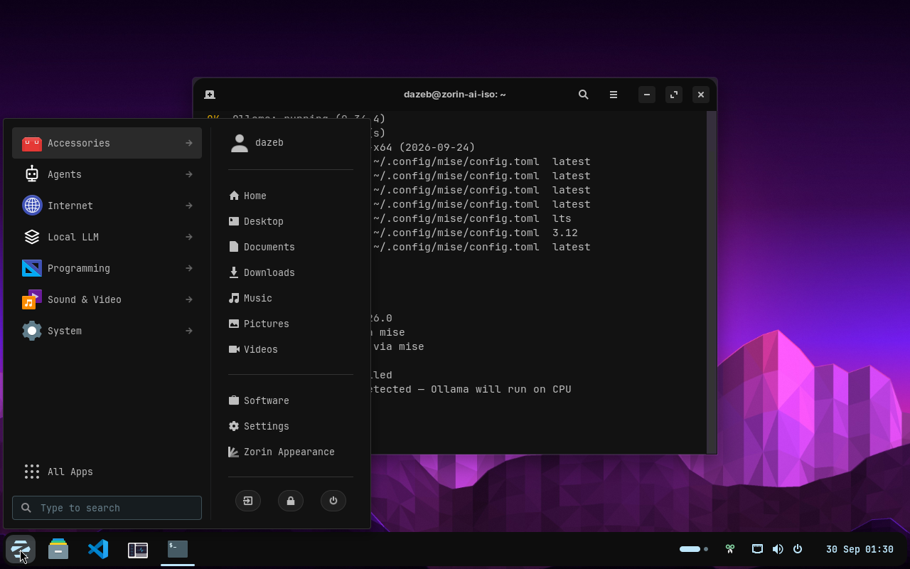

# ZorinAI-Dark: Omarchy design reference

The main design follows [Omarchy's Matte Black palette](https://github.com/basecamp/omarchy/blob/8b4eae66da2938ba9559f103b18dbf85cdf28a70/themes/matte-black/colors.toml)
and coordinated theme model, adapted to Zorin OS 18.1 and GNOME. This is the
starting reference, not a replacement compositor or a copy of Omarchy branding.

## Design decisions

| Element | Decision |
| --- | --- |
| Canvas | `#121212` charcoal |
| Panels | `#0d0d0d`; raised controls `#1e1e1e` |
| Selection | `#2a2a2a` with readable foreground text |
| Borders | `#333333`, 1 px; amber only for focus/active controls |
| Text | `#bebebe`; secondary text `#8a8a8d` |
| Accent | `#e68e0d` amber; dark text on solid accent buttons |
| Typography | JetBrainsMono Nerd Font in the shell, terminal, and editor; GTK retains application fonts |
| Geometry | 4 px maximum corners; menu rows retain mouse-friendly padding |
| Identity | Existing AI menu sections, white glyphs, and polygon wallpapers |

The desktop uses Omarchy's palette roles. Terminal ANSI colors remain distinct
from application status semantics: Matte Black uses amber/yellow for several
ANSI roles, so a terminal color named `green` is not a success indicator.

## Implemented first pass

- Shell: taskbar, menus, search, quick settings, sliders, notifications,
  dialogs, overview, and scrollbars.
- GTK: headers, buttons, inputs, menus, popovers, selections, checks, switches,
  progress indicators, and scrollbars.
- Apps: Microsoft VS Code defaults, GNOME Terminal, Herdr, and btop.
- Persistence: VS Code settings, Continue configuration, app themes, and the
  renamed Nautilus action are provided for new accounts.

`configs/theme/palette.json` is the source for colors, terminal ANSI values,
the monospace font, and corner radius. CSS templates live next to it. Run:

```sh
python3 scripts/render-theme.py
python3 scripts/render-theme.py --check
python3 -m unittest discover -s tests -v
```

The generated files are committed so installation needs no design tools or
network theme downloads. `scripts/build-desktop-theme.py` combines these
overrides with the installed Zorin base and changes only differing files.
The original system themes are never patched in place.

## Settings and migration

The GUI module installs VS Code first, then removes installed apt packages
`codium`, `chatbox`, `xyz.chatboxapp.app`, and `foot` without purging settings or
running autoremove. The retired VSCodium menu action is removed from the current
user and `/etc/skel`. GNOME Terminal remains the workstation terminal.

Existing VS Code settings are kept verbatim, including JSONC comments and
custom colors. They are not silently replaced with theme defaults. VSCodium
settings remain on disk for manual import into VS Code. Existing Herdr settings
are updated only if they exactly match the previous installer default.

## Remaining surfaces and limits

Libadwaita, Qt, Flatpak, Snap, and apps with internal themes may not adopt GTK
overrides. This pass does not force `GTK_THEME`, write global user GTK CSS,
change GDM, or modify Zorin extensions. It also does not install Foot, Hyprland,
SDDM, Quickshell, or Omarchy's theme switcher.

The first pass includes selectors from the installed Zorin menu and taskbar.
Next passes should review their remaining states, add app-specific Qt/Flatpak
integration where supported, and review
wallpapers against the calmer desktop. Shell/menu changes need a new session.

Before a release, verify the installer twice on VM 114, reboot and inspect the
session, then rebuild and boot-test the ISO from the published repository.

## Validation — 2026-09-30

- Bash syntax, Docker ShellCheck at warning severity, JSON/TOML parsing, palette
  output consistency, and four theme-composition regression tests passed.
- Two full installer passes completed on VM 114. VS Code 1.139.1 and the five
  configured extensions installed; VSCodium and Chatbox were removed. Foot was
  already absent. The new desktop ID is pinned and the Nautilus action is renamed.
- All 433 checked base-theme, custom-theme, and user configuration files retained
  their contents and timestamps on the second full pass. The final CSS refinement
  also produced no changes on its second theme-module pass.
- GTK 3 and GTK 4 reported no CSS parsing diagnostics. After reboot, GNOME Shell
  loaded ZorinAI-Dark without theme-parser errors; the menu and terminal were
  inspected. `noc doctor` was green.
- The reference VM is restored after testing. These worktree changes have not
  been published or baked into a new ISO.


